# Teksimap

<p align="center">
  <strong>Making minibus taxi transportation easier for commuters and more beneficial for taxi owners and drivers.</strong>
</p>

Teksimap is a **marketplace and navigation platform** for long-distance minibus taxi transportation in South Africa. It connects passengers and parcels with drivers, while providing map-based directional guidance built around existing taxi routes.

---

## Table of Contents

- [Overview](#overview)
- [Architecture](#architecture)
- [Tech Stack](#tech-stack)
- [Project Structure](#project-structure)
- [Getting Started](#getting-started)
- [Documentation](#documentation)

---

## Overview

### What Teksimap Does

| Feature | Description |
|--------|-------------|
| **Route Planning** | Helps commuters understand how to travel using existing minibus taxi routes |
| **Booking Marketplace** | Connects passengers and parcels with long-distance taxi drivers |
| **Real-Time Tracking** | Live vehicle position updates via WebSocket for active bookings |
| **Payment Integration** | Yoco payment gateway for secure transactions |
| **Multi-Role Portal** | Separate experiences for Customers, Drivers, Owners, and Admins |

### User Roles


---

## Architecture

### High-Level System Architecture

```mermaid
flowchart TB
    subgraph Clients["🌐 Clients"]
        Web[Web Browser]
        Android[Android App]
        iOS[iOS App]
    end

    subgraph Edge["Edge / Reverse Proxy"]
        Nginx[Nginx<br/>SSL Termination<br/>Static Files]
    end

    subgraph Backend["⚙️ Backend API"]
        Express[Express.js Server<br/>Port 3000]
        Socket[Socket.io<br/>WebSocket Server]
    end

    subgraph DataLayer["💾 Data Layer"]
        MySQL[(MySQL<br/>Primary Database)]
        Redis[(Redis<br/>Position Cache<br/>Vehicle Tracking)]
    end

    subgraph External["🔗 External Services"]
        Yoco[Yoco<br/>Payment Gateway]
        Email[SMTP<br/>Email Service]
    end

    Web & Android & iOS --> Nginx
    Nginx --> Express
    Nginx -.->|WebSocket| Socket
    Express --> MySQL & Redis
    Express --> Yoco & Email
    Socket --> Redis
```



### Request & Data Flow


### Real-Time Tracking Flow


### Backend Architecture


### Database Schema (Core Entities)


### Frontend Architecture


### Deployment Architecture (Production)


---

## Tech Stack

| Layer | Technology |
|-------|------------|
| **Frontend** | Vite, Vanilla JS, Axios, Turf.js, JSTS |
| **Mobile** | Capacitor (Android / iOS) |
| **Backend** | Node.js, Express |
| **Database** | MySQL (Sequelize ORM) |
| **Cache** | Redis |
| **Real-Time** | Socket.io |
| **Payments** | Yoco |
| **Jobs** | Bull (Redis-backed queue) |
| **Routing** | Custom Dijkstra implementation |
| **Deployment** | Docker, Nginx, AWS EC2, AWS RDS |

---

## Project Structure

```
Map_Practise/
├── backend/                    # Express API
│   ├── config/                 # DB, Redis, Socket, configurations
│   ├── controllers/            # Business logic per domain
│   ├── Middleware/             # Auth, validation
│   ├── models/                 # Sequelize models
│   ├── routes/                 # Route definitions
│   ├── services/               # Email, etc.
│   ├── src/                    # Dijkstra, Graph, routing helpers
│   ├── migrations/             # SQL migrations
│   ├── queue/                  # Bull job queues
│   └── server.js
│
├── frontend/                   # Vite multi-page app
│   ├── pages/                  # HTML entry points
│   │   ├── authentication/
│   │   ├── customer/
│   │   ├── admin/
│   │   ├── Owner/
│   │   └── home/
│   ├── js/                     # Domain scripts
│   │   ├── api/                # API clients
│   │   ├── authentication/
│   │   ├── customer/
│   │   ├── admin/
│   │   └── owner/
│   ├── css/
│   ├── assets/
│   ├── android/                # Capacitor Android
│   ├── ios/                    # Capacitor iOS
│   └── vite.config.js
│
├── config/                     # Environment templates
├── docs/                       # Documentation
├── nginx/                      # Reverse proxy config
└── docker-compose*.yml         # Docker setups
```

---

## Getting Started

### Prerequisites

- Node.js 18+
- MySQL 8+
- Redis (optional, for vehicle position caching)
- Docker & Docker Compose (for containerized setup)

### Environment Setup

1. **Backend**: Copy `config/.env.development` to `backend/.env.development` and configure.
2. **Database**: Ensure MySQL is running. Apply SQL from `backend/migrations/` as needed.

### Install & Run

```bash
# Backend
cd backend && npm install && nodemon server.js

# Frontend (separate terminal)
cd frontend && npm install && npm run dev
```

- **Backend**: Default `http://localhost:3000`
- **Frontend**: Vite dev server `http://localhost:5173`

### Build & Mobile

```bash
# Build frontend
cd frontend && npm run build

# Sync Capacitor for native apps
npx cap sync

# Open in IDE
# Android: frontend/android (Android Studio)
# iOS: frontend/ios (Xcode)
```

### Docker (Production)

```bash
# Local test
./test-docker-local.sh

# Deploy to AWS
./deploy-aws.sh
```

See `docs/README_DOCKER.md` and `docs/DOCKER_DEPLOYMENT.md` for full instructions.

---

## Documentation

| Document | Description |
|----------|-------------|
| [Developer Introduction](docs/teksimap_developer_introduction.md) | Philosophy, workflow, contributing |
| [Docker Setup](docs/README_DOCKER.md) | Docker & deployment overview |
| [Docker Deployment](docs/DOCKER_DEPLOYMENT.md) | Full deployment guide |
| [AWS EC2 Setup](docs/AWS_EC2_SETUP.md) | EC2 instance configuration |
| [RDS Setup](docs/RDS_SETUP_GUIDE.md) | AWS RDS MySQL setup |
| [Database Indexes](docs/DATABASE_INDEXES_EXPLANATION.md) | Index strategy |
| [Database Extensions](docs/DATABASE_EXTENSIONS_GUIDE.md) | Spatial extensions |

---

## Health Check

```bash
curl http://localhost:3000/health
```

Expected response includes `status`, `environment`, `uptime`.

---

## License

Proprietary. See project agreements for usage and contribution terms.

---

<p align="center">
  <em>Building momentum, not perfection.</em> — Teksimap
</p>
